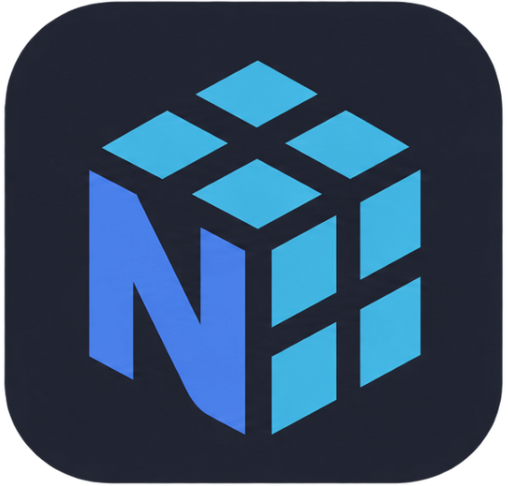
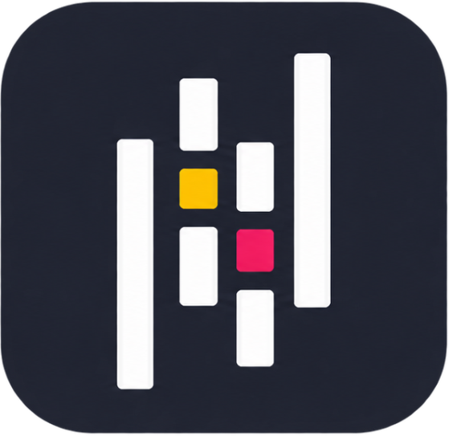
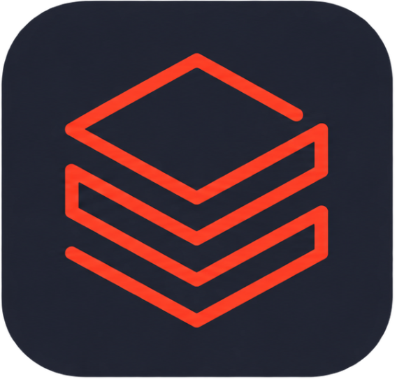

  

# hey, i'm siddharth 👋

### i like turning data into something useful.

**machine learning · deep learning · data science · data engineering**

---

## about me

- 🧠 fascinated by **machine learning & deep learning**
- 📊 love finding interesting things hidden inside **data**
- ⚙️ interested in building the systems and pipelines that make data useful
- 🔬 usually learning something, building something, or wondering *"what if?"*

---

## tech stack

<!-- top row: 7 -->

 

<!-- bottom row: 6 -->

---

## connect with me

&nbsp;&nbsp;&nbsp;
&nbsp;&nbsp;&nbsp;
&nbsp;&nbsp;&nbsp;

---

### build · learn · experiment · repeat

